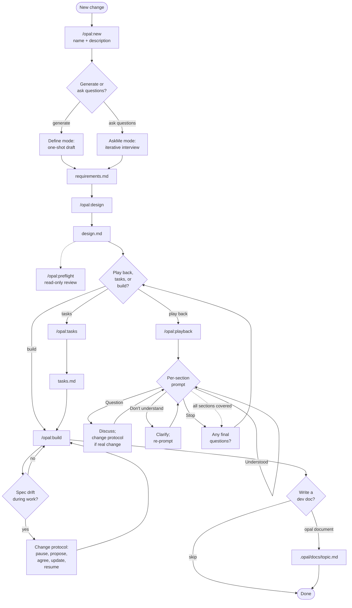

# OpalSpec

**Spec-driven development, shaped around how you work.**

OpalSpec is a lightweight spec-driven development workflow for AI coding agents. It separates planning from implementation so the agent always has the context it needs to act precisely — and lets you skip the parts you don't need.

OpalSpec is deliberately file-based. Each change becomes a small spec folder that can be reviewed, edited, committed, and used by any AI tool that reads markdown.

```text
.opal/
  specs/<change-name>/   # per-change requirements / design / (optional) tasks
  docs/<topic>.md        # optional dev guides written after build
  runtime/               # protocols and prompts the agent reads (upstream-owned)
  README.md
  VERSION
```

## The Flow



Forks at every interactive step:

- **`/opal:new`** asks "generate a draft, or ask questions to clarify direction?" — that single fork replaces the older define / askme commands.
- **After design**, you pick the next stage: optional **playback**, optional **tasks**, or jump straight to **build**.
- **Preflight** is an optional user-invoked second-agent review after design. The design-authoring agent does not offer it automatically; run `/opal:preflight` in another agent context when you want a read-only critique before implementation.
- **Playback** forks four ways per section: Understood / Question (probe or challenge) / Don't understand (clarify) / Stop (end the walk early). After the walk it asks if you have any final questions before the next stage.
- **Implementation** triggers the change protocol whenever reality diverges from the spec. It also offers an optional **`/opal:document`** stage at the end to write or update a dev guide.

## The Documents

`requirements.md` is behavior-first. EARS-style acceptance criteria with `WHEN` / `IF` / `THEN` / `SHALL`, plus a glossary.

`design.md` is implementation-facing. Files, modules, components, interfaces, data models, correctness properties, error handling, testing strategy.

`tasks.md` is execution-facing — but **optional**. Numbered, verifiable tasks with traces like `_Requirements: 1.1, 2.3_`. Skip it for small changes; `/opal:build` works directly from `design.md` when there's no `tasks.md`. When present, `tasks.md` is also the resume ledger: agents update completed task and checkpoint checkboxes as they build.

`.opal/docs/<topic>.md` is human-facing. A dev guide explaining what was built and how it works in plain language. Multiple specs can update the same topic over time.

## How To Use It

After installing OpalSpec into a repo, kick off a new change:

```text
/opal:new "<feature-name>" "<description of what to build>"
```

Both arguments are optional — if you skip them the agent will ask. It then asks: **Would you like me to generate a draft requirements doc, or ask you questions to clarify direction first?**

After requirements are settled, continue one stage at a time:

```text
/opal:design        # write design.md from requirements
/opal:preflight     # optional: read-only second-agent review of design.md
/opal:playback      # optional: walk the design with Understood/Question/Don't-understand/Stop
/opal:tasks         # optional: turn the design into a task plan
/opal:build         # implement from tasks.md if present, else from design.md
/opal:document      # optional: write/update .opal/docs/<topic>.md
```

The spec name is optional for any stage after `/opal:new` — if omitted, the agent infers the active spec (single-spec wins outright; multiple-spec picks the most recently modified and confirms with you).

For Codex, the skill-style invocation is:

```text
$opalspec new <change-name>: <description>
$opalspec create design for <change-name>
$opalspec preflight <change-name>
$opalspec play back design for <change-name>
$opalspec create tasks for <change-name>
$opalspec build <change-name>
$opalspec document <topic>
```

## Tool Support

OpalSpec includes prompt, command, or skill files for:

- Codex
- Claude Code
- Cursor
- Gemini CLI
- GitHub Copilot

Each install is scoped to the tools you actually use — you pass `-Tool` when installing (see [INSTALL.md](INSTALL.md)). All tool wrappers point back to `.opal/runtime/spec-authoring-instructions.md`, which is the source of truth for the workflow rules. Interactive flows (new, askme, playback), preflight, the change protocol, and the document stage have their own canonical docs alongside it.

## Install

Install the OpalSpec CLI with npm:

```bash
npm install -g @opalspec/opalspec@latest
```

Then initialize OpalSpec in your project:

```bash
cd your-project
opalspec init --tools codex
```

Use the tools you actually use:

```bash
opalspec init --tools codex,claude,cursor
```

You can also run without a global install:

```bash
npx @opalspec/opalspec@latest init --tools codex
```

See [INSTALL.md](INSTALL.md) for update, migration, and fallback PowerShell installer details.
