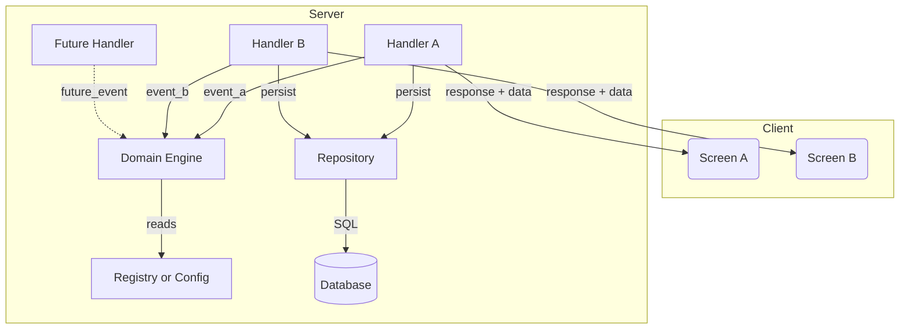

# Design Document: <Feature Name>

## Overview

<Summarize the chosen approach, main affected layers, and how it satisfies the requirements. Mention important exclusions.>

## Goals / Non-Goals

**Goals:**

- <What this design must achieve — capability, behaviour, or constraint.>
- <Another concrete goal.>
- <Another concrete goal.>

**Non-Goals:**

- <Something explicitly out of scope for this change — moved to a follow-up, handled elsewhere, or deliberately not addressed.>
- <Another non-goal.>
- <Another non-goal.>

## Decisions

*Each decision captures a non-trivial choice the design makes. State the choice in one line, the reasoning behind it, and the leading alternative you rejected. Skip when there is nothing meaningful to record — Decisions exist for cross-layer or architectural calls, not trivial picks.*

### Decision 1: <Short title that names the choice>

**Outcome**: <One sentence stating what you decided.>

**Reasoning**: <Why this is the right call here. Reference the requirements it satisfies, the constraints it respects, or the existing patterns in the codebase it aligns with. Two to four sentences.>

**Alternative Options**: <The leading option you did not pick, and why. One to three sentences. If there were multiple alternatives worth recording, list them as separate bullets. If there were no meaningful alternatives with tradeoffs against the decided choice you can ignore this>

### Decision 2: <Short title that names the choice>

**Outcome**: <One sentence stating what you decided.>

**Reasoning**: <Why this is the right call here.>

**Alternative Options**: <The option you did not pick, and why.>

## Architecture

<Describe the data/control flow and layer boundaries. Include a diagram, a step list, or both — whichever communicates the shape best for this change.>

### Runtime Component Flow Diagram *(when applicable)*

*Use this diagram type when the design has multiple runtime components that interact across deployment boundaries (Client, Server, External, etc.) and you need to show **what talks to what, where it runs, and how data and control move**. Skip this whole subsection for designs that are single-layer, purely internal, or where a sequence/data-flow diagram fits better. When you do include one, follow the rules below so diagrams stay consistent across specs.*

**Rules**

- Use Mermaid `flowchart TD` (top-down).
- Group components into `subgraph` blocks by deployment boundary (`Client`, `Server`, `External`, etc.). Each subgraph contains only the components that run in that boundary.
- Stay at **one abstraction level** — runtime components, not classes or individual functions.
- Use standard shapes: **rectangles** for services/modules (`H[Handler]`), **cylinders** for databases (`DB[(Database)]`), **rounded rectangles** for UI (`UI(Screen)`).
- Use short node IDs with readable labels: `AE[Achievement Engine]`.
- Use **solid arrows** (`-->`) for current flow, **dashed arrows** (`-.->`) for planned or future flow.
- Label every arrow with the data type or event name being passed: `|run_complete|`, `|persist unlocks|`, `|response + data|`. Arrow direction must match the control-flow / data-push direction.
- Layout: handlers and entry points at the top of `Server`, domain / business logic in the middle, persistence at the bottom. `Client` components stay separate, connected via response arrows from handlers.
- Aim for **8–12 nodes**. If you need more, split into multiple diagrams.
- Every component must have at least one incoming or outgoing arrow — no orphans.
- No colors or custom styling. Plain Mermaid only.

**Skeleton**



### Layer Placement

| Concern | Layer | Location |
|---------|-------|----------|
| <Concern> | <Domain/Server/UI/etc.> | `<path>` |

## Components and Interfaces

### `<Component or Module>`

```typescript
export interface Example {
  readonly id: string;
}
```

<Explain responsibilities, inputs, outputs, side effects, and integration points.>

## Data Models

### `<Model Name>`

```typescript
export interface ModelName {
  readonly field: string;
}
```

<Include database schema, OpenAPI fragments, serialized JSON shapes, or UI props as applicable.>

## Correctness Properties

*A property is a behavior that should hold across all valid executions of the system. Properties bridge the human-readable spec and machine-verifiable tests.*

### Property 1: <Property Name>

*For any* <input/state>, THE <system/component> SHALL <invariant or expected behavior>.

**Validates: Requirements 1.1, 1.2**

### Property 2: <Property Name>

*For any* <input/state>, WHEN <condition>, THE <system/component> SHALL <expected behavior>.

**Validates: Requirements 2.1**

## Error Handling

- <Failure mode>: <Handling behavior and whether it is blocking or non-blocking.>
- <Missing data>: <Fallback behavior.>
- <Invalid input>: <Validation or error response.>

## Testing Strategy

### Unit Tests

- <Specific unit test target and scenario.>

### Property-Based Tests

- **Property 1: <name>** targeting `<module/function>`.
- **Property 2: <name>** targeting `<module/function>`.

### Integration/Contract/UI Tests

- <Cross-layer test, API contract test, UI render test, or Storybook visual check.>

### Test File Organization

```text
<path>/
  <test-file>.test.ts
```
